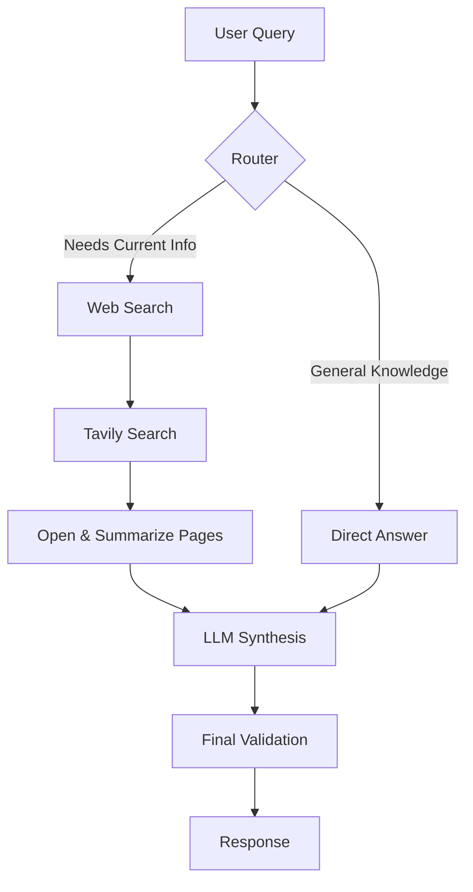

# Tool-Calling Search Agent

An AI-powered search agent that intelligently routes queries to either perform web searches or answer from its training knowledge. Built with LangChain, Angular, and Express.js.

## 🌟 Features

- **Intelligent Query Routing**: Automatically determines whether a query requires web search or can be answered from training data
- **Web Search Integration**: Uses Tavily API for real-time web search capabilities
- **Multi-Model Support**: Compatible with OpenAI, Google, Groq, and Ollama models
- **Content Summarization**: Fetches and summarizes web page content for comprehensive answers
- **Security**: Helmet, CORS, and rate limiting protection
- **Logging**: Winston logger with configurable levels and formats
- **Development Mode**: Includes dummy web search results for testing

## 🏗️ Architecture



## 📦 Tech Stack
**Backend**
- Runtime: Node.js with TypeScript
- Framework: Express.js 5.x
- AI Framework: LangChain.js 1.x
- Web Search: Tavily API
- Content Extraction: html-to-text
- Security: Helmet, CORS, Rate Limiting
- Logging: Winston

**Client**
- Framework: Angular 21.x
- Styling: TailwindCSS 4.x
- Testing: Vitest
- Build Tool: Angular CLI

## 🚀 Getting Started
**Prerequisites**
- Node.js 18+
- npm 11+
- Tavily API key for web search
- LLM API keys for different providers
- OR Ollama installed [When using Ollama as model provider]

**Installation**
```bash
# Install root dependencies
npm install

# Install backend dependencies
cd backend
npm install

# Install client dependencies
cd ../client
npm install
```

**Configuration**

Create a `.env` file in the backend directory:
```bash
# Server Configuration
NODE_ENV=development
PORT=3000
HOST=localhost
RUN_MODE=no_debug

# AI Model Provider (ollama, openai, google, groq)
MODEL_PROVIDER=ollama

# OpenAI Configuration
OPENAI_API_KEY=your_openai_key
OPENAI_MODEL=gpt-5.4-mini

# Google Configuration
GOOGLE_API_KEY=your_google_key
GOOGLE_MODEL=gemma-4-31b-it

# Groq Configuration
GROQ_API_KEY=your_groq_key
GROQ_MODEL=groq/compound

# Ollama Configuration
OLLAMA_BASE_URL=http://localhost:11434
OLLAMA_MODEL=qwen3.5:4b
OLLAMA_EMBEDDING_MODEL=nomic-embed-text
OLLAMA_TEMPERATURE=0.7
OLLAMA_NUM_CTX=4096

# Tavily Configuration
TAVILY_API_KEY=your_tavily_key
TAVILY_MAX_RESULTS=10

# Route Strategy (basic or advanced)
ROUTE_STRATEGY=advanced

# Agent Configuration
AGENT_MAX_ITERATIONS=10
AGENT_VERBOSE=false

# Rate Limiting
RATE_LIMIT_WINDOW_MS=60000
RATE_LIMIT_MAX_REQUESTS=60

# Logging
LOG_LEVEL=debug
LOG_FORMAT=pretty
```

**Running the Application**
```bash
# Development mode (runs both client and backend)
npm run dev

# Or run separately
# Backend only
cd backend
npm run dev
# OR from main directory
npm run dev:backend

# Client only
cd client
npm start
# OR from main directory
npm run dev:client

# Build for production
npm run build
```

## 📝 API Usage

Search Endpoint

POST `/search`

Request body:
```json
{
  "query": "What is the latest news about AI development?"
}
```

Response:
```json
{
  "query": "What is the latest news about AI development?",
  "answer": "Artificial intelligence is rapidly evolving...",
  "follow_up_questions": [
    "What are the latest AI models?",
    "How is AI being used in healthcare?"
  ],
  "results": [
    {
      "title": "AI Development Update 2026",
      "url": "https://example.com",
      "content": "..."
    }
  ],
  "response_time": 1.23,
  "request_id": "abc123"
}
```

## 🔧 Configuration Options
**Route Strategies**
1. **Basic Route Strategy**: Uses keyword patterns to determine if web search is needed

    - Detects patterns like "top", "best", "rank", "price", "weather", "news", etc.
    - Fast and deterministic

2. **Advanced Route Strategy**: Uses an LLM to analyze query intent

    - More nuanced decision-making
    - Requires an LLM model
    - Better for complex queries

**Model Providers**
- **Ollama**: Local LLM inference (default)
- **OpenAI**: Cloud-based models
- **Google**: Gemini models
- **Groq**: Fast inference models

## 🧪 Testing
**Backend Testing**
```bash
cd backend
npm run type-check
npm run lint
npm run lint:fix
npm run format
npm run format:check
```

**Cient Testing**
```bash
cd client
npm run test
```

## 📁 Project Structure
```text
tool-calling-search/
├── package.json (root workspace config)
├── backend/
│   ├── src/
│   │   ├── app.ts (Express app setup)
│   │   ├── index.ts (entry point)
│   │   ├── common/ (shared types and constants)
│   │   ├── config/ (environment and schema configs)
│   │   ├── routes/ (API routes)
│   │   └── search_tool/ (search chain logic)
│   └── package.json
├── client/
│   ├── src/
│   │   ├── app/ (Angular application)
│   │   └── styles/
│   └── package.json
└── README.md
```

## 🤝 Contributing
1. Fork the repository
2. Create a feature branch (git checkout -b feature/amazing-feature)
3. Commit your changes (git commit -m 'Add amazing feature')
4. Push to the branch (git push origin feature/amazing-feature)
5. Open a Pull Request

## 📄 License

ISC

## 👤 Author

Pranav Pande
